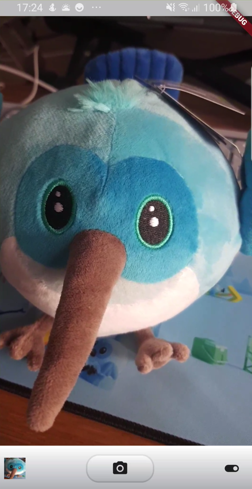
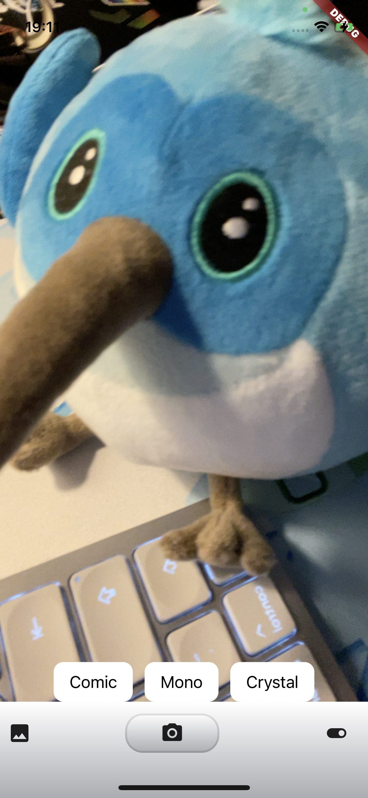
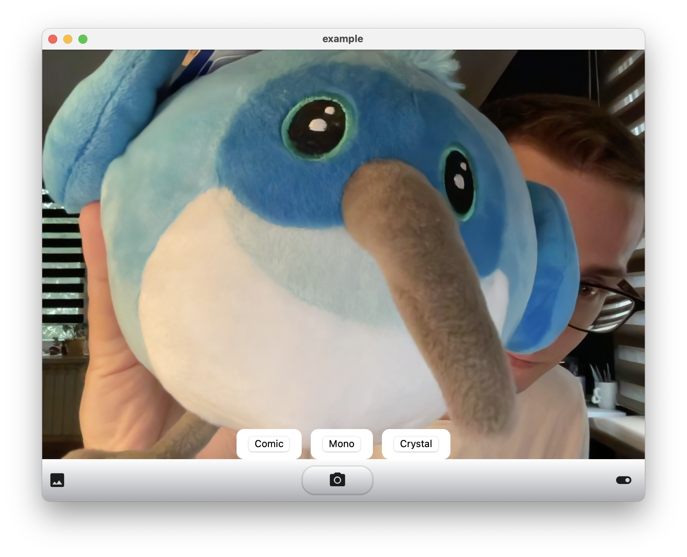

# NativeCameraView

An example of Flutter Platform View plugin that works as a camera preview and capture.

| Android                                              | iOS                                           | macOS                                            |
| ---------------------------------------------------- | --------------------------------------------- | ------------------------------------------------ |
|  |  |  |

This sample has been presented during Flutter Vikings 2022 conference in Oslo.

If you'd like to learn more about Flutter, feel free to follow me [here](https://roszkowski.dev/).

## Getting Started

Make sure to use a recent `master` version of Flutter (e.g. `3.5.0-10.0.pre.36`).

I recommend opening the whole workspace in VS Code by calling:

```sh
code .
```

You will see the following directories:

- `example` - our application
- `camera_view` - federated plugin
  - `camera_view` - Dart implementation of the interface and widgets
  - `camera_view_platform_interface` - a common platform interface for the `camera_view` plugin
  - `camera_view_xxx` - platform implementations of the plugin

Try it out by running the example app on your desired device (iOS, Android, or macOS). There's VS Code launch configuration available.

## Camera details

This sample hosts camera previews on the following platforms:

| Platform | Support |
| -------- | ------- |
| iOS      | Yes     |
| Android  | Yes     |
| macOS    | Yes     |
| Windows  | No      |
| Linux    | No      |
| Web      | No      |

The iOS and macOS implementations use SwiftUI camera views from [this article](https://www.raywenderlich.com/26244793-building-a-camera-app-with-swiftui-and-combine) by Yono Mittlefehldt. The license note is included in every file copied from the original implementation.

### Known issues

- macOS platform views don't handle gestures, throw exceptions when tapping anywhere even when ignoring touch events
- macOS platform views cannot be shown beneath the Flutter widgets thus there's not way to draw UI on top of the platform view
- window resizing on macOS is broken due to [this threading issue](https://github.com/flutter/engine/pull/35894)

## Contributing

Contributions are welcome! If you'd like to improve existing implementation or propose new platform to be supported, please go ahead!
